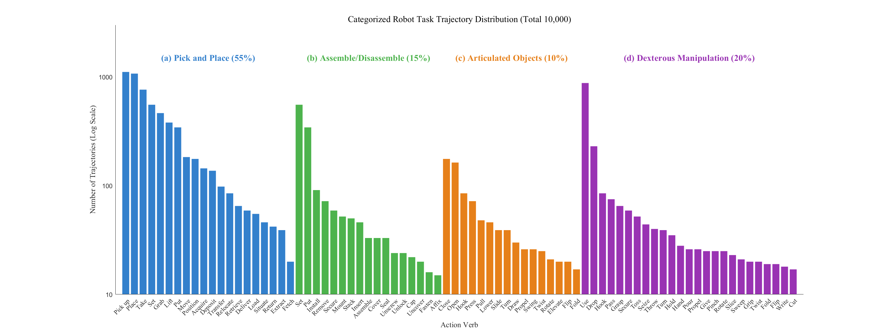
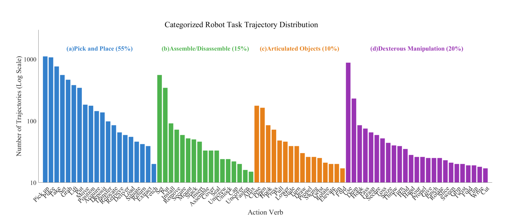

# News & Update
- **2025-11-3:** Released a comprehensive item list for the Dexora Dataset collected in real-world.

# Dexora Dataset

## Overview

This part hosts the **Dexora Dataset**, a real-world robotic manipulation dataset.  To help researchers quickly reproduce or extend our experiments, we share a **comprehensive item list** that contains every object we used, together with:

| Column | Description |
|--------|-------------|
| Object Name (EN & CN) | Clear identification |
| Task Type | pick-and-place / assemble / articulation / dexterous |
| Purchase Link | Ready-to-buy links on **Taobao** & **Amazon** |

 **[Google Spreadsheet – Dexora Real-world Item List](https://docs.google.com/spreadsheets/d/1L2cgqvIukVziXc0OwpqNkb5j8c3bzC_K/edit?usp=sharing&ouid=118201816718027822857&rtpof=true&sd=true)**

