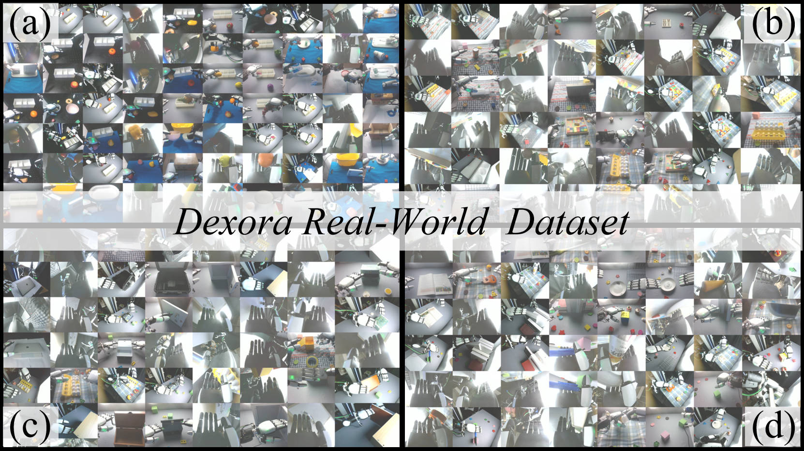

<p align="center">
  <h2>Dexora: Open-Source VLA for High-DoF Bimanual Dexterity</h2>
</p>

<p align="center">
  <a href="#"></a>
  <a href="https://dexoravla.github.io/"></a>
  <a href="LICENSE"></a>
</p>


## 🔥 News & Updates


- **2025-12-03**: Released the full **Real-World Dataset** (**10K episodes**)  on Hugging Face.

--

## 📊 Dataset Overview

The Dexora corpus combines **high-fidelity real-world teleoperation data** with a **large-scale simulated dataset** designed to match the embodiment of the physical robot.

### A. Dexora Real-World Dataset (High-Fidelity)

The Dexora real-world dataset consists of **10K teleoperated episodes**, **3.2M frames**, and **177.5 hours** of data. Demonstrations are collected using a **hybrid teleoperation system** that couples an **Exoskeleton** (for arm control) with **Vision Pro** (for dexterous hand control), enabling precise 36-DoF bimanual manipulation on real hardware.

<p align="center">
  
</p>

<p align="center">
  <i>Video 1. <b>Synchronized Multi-View Recordings.</b> High-resolution streams from ego-centric, third-person, and wrist-mounted cameras, synchronized with 36-DoF robot proprioception.</i>
</p>

<p align="center">
  
</p>

<p align="center">
  <i>Fig 1. <b>High-Fidelity Real-World Scenes.</b> Collected via our hybrid teleoperation system (Exoskeleton for arm + Vision Pro for hand), this dataset covers <b>347 objects</b> across diverse environments. It captures varying lighting conditions, background clutter, and precise bimanual interactions essential for robust policy learning. Panels (a–d) correspond to four task categories: <b>pick-and-place</b>, <b>assembly</b>, <b>articulation</b>, and <b>dexterous manipulation</b>.</i>
</p>

<p align="center">
  
</p>

<p align="center">
  
</p>

<p align="center">
  <i>Fig 2. <b>Task Categories & Action Distribution.</b> Unlike standard gripper datasets, Dexora emphasizes high-DoF dexterity. The real-world data distribution includes <b>Dexterous Manipulation (20%)</b> (e.g., <i>Twist Cap</i>, <i>Use Pen</i>, <i>Cut Leek</i>) and <b>Assembly (15%)</b> (e.g., <i>Separate Nested Bowls</i>, <i>Stack Ring Blocks</i>), in addition to <b>Articulated Objects (10%)</b> and <b>Pick-and-Place (55%)</b>.</i>
</p>

Both the episodes and annotations follow the **LIBERO-2.1 standard**, including synchronized **RGB observations**, **robot proprioception**, **actions**, and **language instructions**.

### Object Inventory & Reproducibility

Reproducibility is a **core value** of Dexora. To enable other labs and industry teams to **faithfully recreate** our environments, we release a **curated object inventory** that mirrors the physical setup used in our real-world experiments.

- **Scale**: **347 objects** across **17 semantic categories** (e.g., tools, containers, articulated objects, deformables, daily-use items).
- **Coverage**: Objects are chosen to stress **dexterous control**, **bimanual coordination**, and **long-horizon manipulation**.
- **Procurement**: Every item is linked to **Taobao** and/or **Amazon**, so researchers can rebuild the setup with minimal effort.

<p align="center">
  <a href="https://docs.google.com/spreadsheets/d/1L2cgqvIukVziXc0OwpqNkb5j8c3bzC_K/edit?usp=sharing">
    <b>📑 Access Dexora Real-world Item List (Google Sheet)</b>
  </a>
</p>

### Inventory Metadata Schema

The released Google Sheet follows the schema below:

| Column                     | Description                                                                 |
| :------------------------- | :-------------------------------------------------------------------------- |
| **Object Name (EN & CN)** | Bilingual identification for global researchers.                            |
| **Task Type**             | One of: `pick-and-place`, `assemble`, `articulation`, `dexterous`.          |
| **Purchase Link**         | Direct links to **Taobao** & **Amazon** for easy procurement and restock.   |

You can **filter by task type**, **category**, or **store** to design controlled benchmarks or new task suites on top of Dexora.


### B. Dexora Simulation Dataset (Large-Scale)

The Dexora simulation dataset contains **100K episodes** generated in **MuJoCo**, using the same **36-DoF dual-arm, dual-hand** embodiment as the real robot. It provides large-scale, embodiment-matched experience focused on core skills such as **pick-and-place**, **assembly**, and **articulation**, which can be used for pre-training basic competence before **fine-tuning on the real-world dataset**.

### Summary Statistics (Sim vs Real)

| **Split**        | **Episodes** | **Frames** | **Hours (approx.)** | **Task Types**                                                                 |
| :--------------- | -----------: | ---------: | -------------------: | :----------------------------------------------------------------------------- |
| **Simulated**    | **100K**     | **6.5M**   | TBD                  | Pick-and-place, assembly, articulation |
| **Real-World**   | **10K**      | **3.2M**   | **177.5**            | Teleoperated bimanual tasks with high-DoF hands, cluttered scenes, fine-grain object interactions |

---


---

## 📂 Data Structure

Dexora follows the **LIBERO-2.1** dataset standard. Each episode is stored as a self-contained trajectory with:

- **Observations**: multi-view RGB (and optionally depth), segmentation masks (when available).
- **Robot State**: joint positions/velocities for dual arms and dual hands, gripper/hand states.
- **Actions**: low-level control commands compatible with 36-DoF bimanual control.
- **Language**: High-level task descriptions. We provide **5 diverse natural language instructions** per task, distributed evenly across all trajectories to enhance linguistic diversity.

An example high-level directory layout is:

```text
data
├── real
│   ├── articulation
│   │   └── ...
│   ├── assembly
│   │   └── ...
│   ├── dexterous manipulation                     
│   │   ├── data 
│   │   │   ├── chunk-000 
│   │   │   │   ├── episode_000000.parquet
│   │   │   │   ├── episode_000001.parquet
│   │   │   │   ├── episode_000002.parquet
│   │   │   │   ├── ...
│   │   │   ├── chunk-001
│   │   │   │   ├── ...
│   │   │   ├── ...
│   │   ├── meta
│   │   │   ├── episodes.jsonl  
│   │   │   ├── episodes_stats.jsonl   
│   │   │   ├── info.json      
│   │   │   ├── modality.json  
│   │   │   ├── stats.json     
│   │   │   ├── tasks.jsonl   
│   │   ├── videos
│   │   │   ├── chunk-000 
│   │   │   │   ├── observation.images.front
│   │   │   │   │   ├── episode_000000.mp4
│   │   │   │   │   ├── episode_000001.mp4
│   │   │   │   │   ├── ...
│   │   │   │   ├── ...
│   │   │   ├── chunk-001
│   │   │   │   ├── ...
│   │   │   ├── ...
│   ├── pick_and_place
│   │   └── ...
│   ├── ...
├── sim
│   ├── ...

```

> **Note**: The exact folder names and file formats may be updated as we finalize the public release, but the overall **episode-centric LIBERO-2.1 structure** will be preserved.

---

## 📥 Usage

### 1. Environment Setup

We recommend using **conda** to manage dependencies:

```bash
conda create -n dexora python=3.10 -y
conda activate dexora

# Clone this repository
git clone <your-dexora-repo-url>.git
cd Dexora

# Install Python dependencies (example)
pip install -r requirements.txt
```

If you plan to train or fine-tune VLAs, please ensure that **PyTorch**, **CUDA**, and any required simulation backends (e.g., Isaac, Mujoco) are installed according to your hardware.

### 2. Downloading the Dataset

- **Simulated Dexora**: Download links will be provided on the **project page** (see badge above).
- **Real-World Dexora**: High-resolution teleoperation data (RGB, proprio, actions) will be hosted via a public storage service (e.g., academic server / cloud bucket).

Typical usage:

```bash
# Example directory where you store data
export DEXORA_DATA=/path/to/dexora

# (Optional) Symlink data into this repo
ln -s $DEXORA_DATA data
```

### 3. Loading Episodes (Example)

Below is a minimal Python snippet illustrating how to load a Parquet episode from the real-world dataset:

```python
import pandas as pd
from pathlib import Path

# Example: Loading a Parquet episode from the real-world dataset
root = Path("data/real/dexterous_manipulation/data/chunk-000")
episode_path = root / "episode_000000.parquet"

# Load trajectory using pandas
df = pd.read_parquet(episode_path)

# Access data columns (Observation, Action, Proprioception)
# Note: Columns are typically flattened in Parquet format
print("Available keys:", df.columns)
print("Actions shape:", df["action"].shape)  # Example access
print("Language Instruction:", df["language_instruction"][0])
```

---

## 📜 Citation

If you find Dexora useful in your research, please consider citing our paper:

```bibtex
@misc{dexora2026,
  title         = {Dexora: Open-Source VLA for High-DoF Bimanual Dexterity},
  author        = {Dexora Team},
  year          = {2026},
  archivePrefix = {arXiv},
  eprint        = {xxxx.xxxxx},
  primaryClass  = {cs.RO}
}
```

---

For questions, collaborations, or feedback, please feel free to open an issue or contact the maintainers via the project page.


